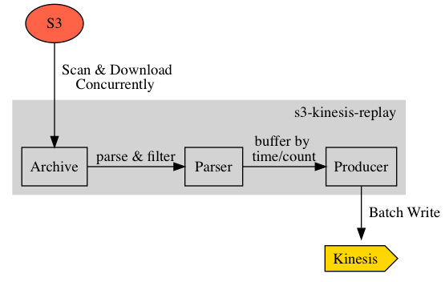

# s3-kinesis-replay
a cli for replaying historical kinesis messages via an s3 archive (e.g. s3 firehose delivery destination)

<p align="center">

</p>

## Installing
**Download**

Currently `s3-kinesis-replay` ships binaries for OSX and Linux 64bit systems. You can download the latest release from [GitHub](https://github.com/cludden/s3-kinesis-replay/releases)

```shell
$ wget https://github.com/cludden/s3-kinesis-replay/releases/download/{version}/{artifact}
```

**Building From Source**

```shell
$ make
```

## Getting Started
View usage information:
```shell
$ s3-kinesis-replay --help
a cli for replaying historical kinesis messages via an s3 archive

Usage:
  s3-kinesis-replay [flags]

Flags:
      --bucket string                         s3 archive bucket name
      --delimiter string                      optional delimiter regexp
      --format string                         parser format
  -h, --help                                  help for s3-kinesis-replay
      --json-concurrency int                  json parser concurrency (default 4)
      --json-schema string                    json parser schema path
      --kinesis-backoff-interval string       kinesis backoff interval
      --kinesis-backoff-max-interval string   kinesis max backoff interval
      --kinesis-buffer-window string          kinesis buffer window size
      --kinesis-endpoint string               kinesis endpoint override
      --kinesis-region string                 kinesis region override
      --log-level string                      log verbosity level
      --partition-key string                  json parser parition key path
      --prefix string                         s3 archive prefix
      --replace string                        optional replace regexp
      --replace-with string                   optional replacement string
      --s3-concurrency int                    s3 download concurrency (default 4)
      --s3-region string                      s3 archive region
      --start-after string                    s3 archive start-after key
      --stop-at string                        s3 archive stop-at key
      --stream-name string                    target kinesis stream name
```

Basic usage with all required flags: *(assumes aws environment is configured)*
```shell
$ s3-kinesis-replay \
    --bucket my-bucket \
    --prefix 2018/01 \
    --stream-name my-stream \
    --format json \
    --partition-key path.to.partitionKey
```
*Note: It is worthwile to use this application from within the same region as your s3 bucket & kinesis stream to avoid s3 egress charges*

## Configuration
`s3-kinesis-replay` uses [viper](https://github.com/spf13/viper) for configuration, and accepts a configuration file, environment variables, cli flags, or a combination of all three.

| Key | EnvVar | Flag | Description | Required | Default |
| :--- | :--- | :--- | :--- | :---: | :---: |
| json.concurrency | JSON_CONCURRENCY | --json-concurrency | number of parser goroutines | | 4 |
| json.partition\_key | JSON\_PARTITION\_KEY | --partition-key | path to json field holding paritition key | true | |
| json.schema| JSON\_SCHEMA| --json-schema | path to json schema file | | |
| kinesis.backoff_interval | KINESIS\_BACKOFF\_INTERVAL| --kinesis-backoff-interval | duration string for initial backoff | | 1s |
| kinesis.backoff\_max\_interval | KINESIS\_BACKOFF\_MAX\_INTERVAL| --kinesis-backoff-max-interval | duration string for max backoff | | 10s |
| kinesis.buffer\_window | KINESIS\_BUFFER\_WINDOW | --kinesis-buffer-window | duration string for buffer window | | 10s |
| kinesis.endpoint | KINESIS\_ENDPOINT | --kinesis-endpoint | optional endpoint override | | |
| kinesis.region | KINESIS\_REGION | --kinesis-region | target stream aws region, will fall back to AWS_REGION environment variable | | |
| kinesis.stream_name | KINESIS\_STREAM\_NAME | --stream-name | target kinesis stream name| true | |
| log.format | LOG\_FORMAT | --log-format | supports `json` or `text` | | json |
| log.level | LOG\_LEVEL | --log-level | logging verbosity | | info |
| parser.delimiter | PARSER\_DELIMITER | --delimiter | used to split s3 objects into multiple messages | | |
| parser.format | PARSER\_FORMAT | --format | the parser to use. currently `json` is the only supported parser | true | |
| parser.replace | PARSER\_REPLACE | --replace | an optional replace regex patter | | |
| parser.replace_with | PARSER\_REPLACE\_WITH | --replace-wth | an optional replacement string | | |
| s3.bucket | S3_BUCKET | --bucket | the s3 bucket name that contains the archive | true | |
| s3.concurrency | S3_CONCURRENCY | --s3-concurrency | the number of goroutines to use for downloading s3 objects | | 4 |
| s3.endpoint | S3_ENDPOINT | --s3-endpoint | an optional s3 endpoint override |  | |
| s3.prefix | S3_PREFIX | --prefix | an optional s3 key prefix | | |
| s3.region | S3_REGION | --s3-region | the s3 bucket region, will fall back to `AWS_REGION` environment variable | | |
| s3.start\_after | S3\_START\_AFTER | --start-after | start scanning after this s3 key | | |
| s3.stop_at | S3\_STOP\_AT | --stop-at | stop scanning at this s3 key | | |

## Contributing
1. [Fork it](https://github.com/cludden/s3-kinesis-replay/fork)
1. Create your feature branch (`git checkout -b my-new-feature`)
1. Commit your changes using [conventional changelog standards](https://github.com/bcoe/conventional-changelog-standard/blob/master/convention.md) (`git commit -am 'feat: adds my new feature'`)
1. Push to the branch (`git push origin my-new-feature`)
1. Ensure linting/tests are all passing
1. Create new Pull Request

## Testing
**Prerequisities**:
- [Docker CE & Compose](https://store.docker.com/search?offering=community&type=edition)

**Testing:**
```shell
# run short tests
$ docker-compose run test make test-short

# run all tests
$ docker-compose run test make test-verbose

# run tests with coverage
$ docker-compose run test make test-coverage
```

**Linting:**
```shell
# run lint
$ docker-compose run test make lint
```

## License
Licensed under the [MIT License](LICENSE.md)

Copyright (c) 2018 Chris Ludden